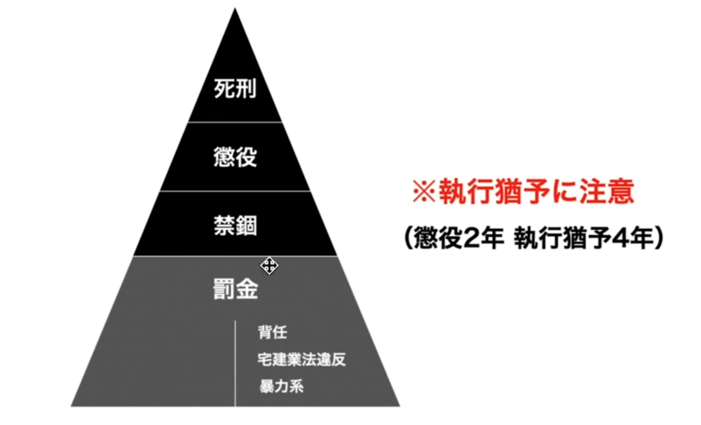

# 宅建講座【ゆーき大学】- Youtube

## Youtube:&#x20;

{% embed url="https://www.youtube.com/watch?v=7Za1JDYTP9Q&list=PLthNnJTp6AOcBsdzS_h3SBsoJdiQoCoA0&index=2&ab_channel=%E3%83%9E%E3%82%B8%E3%81%A7%E3%82%A4%E3%82%B1%E3%81%A6%E3%82%8B%E5%AE%85%E5%BB%BA%E8%AC%9B%E5%BA%A7%E3%80%90%E3%82%86%E3%83%BC%E3%81%8D%E5%A4%A7%E5%AD%A6%E3%80%91" %}

<figure><figcaption></figcaption></figure>

13種類用途地域

<figure><figcaption></figcaption></figure>

宅地に当たらない例外

<figure><figcaption></figcaption></figure>

取引とは

<figure><figcaption></figcaption></figure>

免許の申請手続き

<figure><figcaption></figcaption></figure>

<figure><figcaption></figcaption></figure>

<figure><figcaption></figcaption></figure>

宅建業者名簿の搭載事項

<figure><figcaption></figcaption></figure>

<figure><figcaption></figcaption></figure>

<figure><figcaption></figcaption></figure>

<figure><figcaption></figcaption></figure>

免許不要で宅建業ができる団体

* 国、地方公共団体
* 都市再生機構（UR賃貸住宅）
* 地方住宅供給公社
* 破産管財人
* 信託銀行

<figure><figcaption></figcaption></figure>

免許の欠格事由

<figure><figcaption></figcaption></figure>

<figure><figcaption></figcaption></figure>

免許受けられなくなる犯罪ケース

<figure><figcaption></figcaption></figure>

<figure><figcaption></figcaption></figure>

「執行猶予」

<figure><figcaption></figcaption></figure>

<figure><figcaption></figcaption></figure>

<figure><figcaption></figcaption></figure>

<figure><figcaption></figcaption></figure>

## 宅地建物取引士

<figure><figcaption></figcaption></figure>

<figure><figcaption></figcaption></figure>

<figure><figcaption></figcaption></figure>

<figure><figcaption></figcaption></figure>

<figure><figcaption></figcaption></figure>

<figure><figcaption></figcaption></figure>

<figure><figcaption></figcaption></figure>

<figure><figcaption></figcaption></figure>

## 事務所・案内所

<figure><figcaption></figcaption></figure>

<figure><figcaption></figcaption></figure>

<figure><figcaption></figcaption></figure>

<figure><figcaption></figcaption></figure>

## 営業保証金・保証協会

<figure><figcaption></figcaption></figure>

<figure><figcaption></figcaption></figure>

<figure><figcaption></figcaption></figure>

<figure><figcaption></figcaption></figure>

<figure><figcaption></figcaption></figure>

<figure><figcaption></figcaption></figure>

<figure><figcaption></figcaption></figure>

<figure><figcaption></figcaption></figure>

<figure><figcaption></figcaption></figure>

<figure><figcaption></figcaption></figure>

<figure><figcaption></figcaption></figure>

